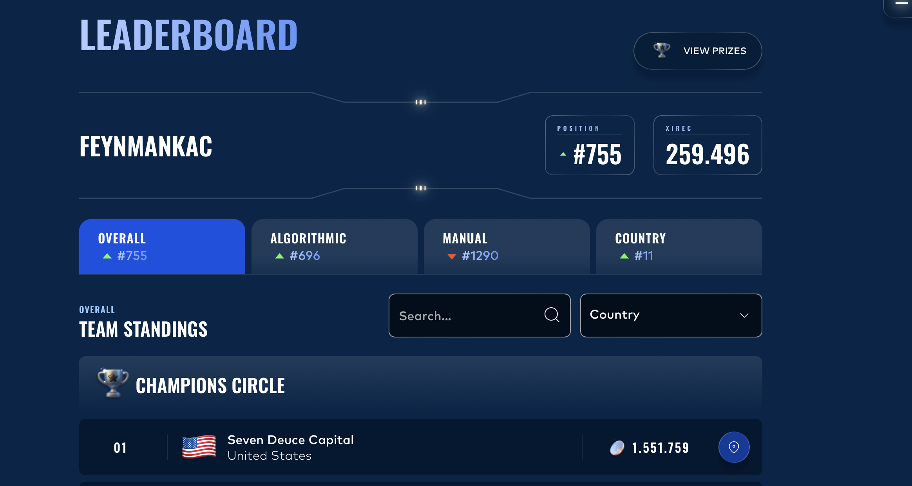

# IMC Prosperity 4

[IMC Prosperity 4](https://prosperity.imc.com/) is a five-round algorithmic trading
competition. Team **FeynmanKac** finished **755th of 18,803** (top 4%), **11th in Italy**,
with 259,496 seashells. The last round was the best: **249th worldwide** on the algorithmic
leg.



Each round had two halves. The **algorithmic** half was a trading bot, submitted and scored
on market data. The **manual** half was one decision, taken once, scored once. This
repository has both, plus the backtester needed to re-run the algorithmic side.

---

## Running a backtest

### 1. Setup, once

```bash
git clone https://github.com/MatteoGrass32/imc-prosperity-4.git
cd imc-prosperity-4
make setup
```

`make setup` creates `.venv` and installs the dependencies. The datasets are already in the
repository, gzipped, so there is nothing to download.

### 2. Run one

```bash
make backtest
```

That backtests the final round 5 trader on round 5 day 2 and prints per-product PnL, then
Sharpe, Sortino, max drawdown and Calmar, then mean and mean-absolute inventory per product.
It takes a couple of minutes on round 5 because that dataset is 36 MB per day.

### 3. Choose the strategy and the day

Two variables, `TRADER` and `DAY`. `DAY` is `<round>-<day>`:

```bash
make backtest TRADER=traders/round5_final.py DAY=5-4
make backtest TRADER=traders/round4_trader.py DAY=4-3
make backtest TRADER=traders/round1_final.py DAY=1--2     # day -2, note the two dashes
```

Available days, matching the folders in `data/`:

| Round | Days | Trader |
|---|---|---|
| 1 | `1--2`, `1--1`, `1-0` | `traders/round1_final.py` |
| 2 | `2--1`, `2-0`, `2-1` | `traders/round2_final.py` |
| 3 | `3-0`, `3-1`, `3-2` | `traders/round3_trader.py` |
| 4 | `4-1`, `4-2`, `4-3` | `traders/round4_trader.py` |
| 5 | `5-2`, `5-3`, `5-4` | `traders/round5_final.py` |

### 4. Without make, or from an IDE

`make` only wraps one command. This is the same thing:

```bash
.venv/bin/python -m prosperity4bt traders/round5_final.py 5-2 --data ./data --out ./run.log
```

To run it from VS Code or PyCharm with the run button instead of the terminal, point the
interpreter at `.venv` and give the module `prosperity4bt` those four arguments. There is no
separate entry point and no notebook: the module is the whole interface.

### 5. Charts

```bash
make visualize
```

Opens a Streamlit page on the most recent `.log`, with PnL, market view and inventory
against the position limits. Stop it with Ctrl+C.

---

## The backtester, and why every round needed a new one

This was the recurring cost of the competition and it is worth being explicit about, because
the code below is shaped by it.

Every round replaced the tradable universe. Not added to it, replaced it. Round 5 said so
outright: you can no longer trade products from previous rounds. And each new universe came
with its own position limits, which are the binding constraint on everything a market maker
does. A backtester that does not know a product does not refuse to run. It falls back to a
default limit and produces numbers that look fine and are wrong.

There were three universes across the five rounds:

| Rounds | Products | Position limit |
|---|---|--:|
| 1, 2 | `ASH_COATED_OSMIUM`, `INTARIAN_PEPPER_ROOT` | 80 |
| 3, 4 | `HYDROGEL_PACK`, `VELVETFRUIT_EXTRACT`, plus the `VEV_*` option chain | 200 and 300 |
| 5 | 50 products in 10 groups of 5 | 10 |

During the competition, moving between them meant editing the engine, and the edits were
easy to get wrong or forget. In this repository that is consolidated into one file,
[`prosperity4bt/rounds.py`](prosperity4bt/rounds.py), which holds every product and limit
keyed by round. Selecting a round is now the `DAY` argument and nothing else. Adding a
sixth round would mean one dict.

Fixing this turned up two real defects in the tooling as it stood:

- The engine shipped with the **tutorial** products, `EMERALDS` and `TOMATOES`, which appear
  in no round 1 to 5 dataset. Every product that was actually traded fell through to the
  default of 80. That is correct for rounds 1 and 2 by coincidence, far too loose for round
  5, where the real limit is 10, and far too tight for rounds 3 and 4, where it is 200 and
  300. Round 5 backtests ran effectively unconstrained and rounds 3 and 4 ran clipped.
- `visualizer.py` kept its **own second copy** of the limits, also tutorial-only, with a
  fallback of 20. The red inventory lines were therefore drawn at 20 in every round of the
  competition, against true limits of 80, 200, 300 and 10. Both files now read the one
  registry, so they cannot disagree again.

Neither fix changes any result reported here: the round 5 book self-limits to 10 internally,
so it was never relying on the engine to stop it. They mean the numbers are now right for
the right reason.

The engine itself is not mine. It is the environment my team built during the competition,
vendored under its MIT licence with those changes plus a repaired `requirements.txt`, which
was missing four packages the engine imports and without which it does not start. Details in
[NOTICE.md](NOTICE.md). Round 5 was also run against a separate Rust backtester,
[GeyzsoN/prosperity_rust_backtester](https://github.com/GeyzsoN/prosperity_rust_backtester),
which is not reproduced here.

---

## The strategies, round by round

Full local backtests in [`results/README.md`](results/README.md). Official scoring, with
submission ids, in [`results/official_submissions.md`](results/official_submissions.md).

### Round 1: market making, and seven submissions

Two products, quoting both sides. [`traders/round1_final.py`](traders/round1_final.py)
scored **95,348**.

The seven submissions leading to it are in
[`traders/iterations/`](traders/iterations/README.md), and their shape is the interesting
part: 1,639, then 1,815, then **9,383**, then 9,552, 9,552, 9,890, 9,890.

One change did it, and the data says why. The two products are not the same kind of object:

| Product | Mean mid | Drift per day |
|---|--:|--:|
| `ASH_COATED_OSMIUM` | ~9,984 | -16.5, -1.0, -6.0 |
| `INTARIAN_PEPPER_ROOT` | 10,483 to 12,474 | +1003.0, +999.5, +1001.5 |

Osmium sits on a fair value near 10,000. Pepper root climbs by a thousand a day, every day,
and ends the third session 30% above where it opened the first. Versions 1 and 2 market made
both of them, pepper root through an EMA-anchored quoter. Quoting a drift like that means
selling into it all day.

Version 3 stopped treating it as a market making problem. Pepper root moved to a
`DirectionalTrendStrategy`, commented in the file as drift exploitation, while osmium stayed
a market maker but went from a fixed 8-tick half-spread to pennying at a minimum edge of 2.
That is 5.2x. The four submissions after it added a dual-layer quoting scheme, aggressive
taking, tiered quotes and a retuned EMA, and produced 5.4% between them, with two returning
a number identical to the submission before them to the last decimal.

The gain was in classifying the instrument, not in tuning the quoter.

### Round 2: same products, and what a strategy is worth once they change

New products, same shape of problem. [`traders/round2_final.py`](traders/round2_final.py)
scored **102,858**.

The first attempt was the round 1 strategy adapted to the new products,
[`traders/iterations/round2_from_round1.py`](traders/iterations/round2_from_round1.py). It
scored **8,654**. Same round, same evaluation, twelve times less. Whatever made round 1 work
was a property of round 1's products and did not travel. Rounds 3 and 4 later paid for the
same lesson at a much higher price.

### Round 3: options on a new underlying

Two underlyings plus a ten-strike option chain.
[`traders/round3_trader.py`](traders/round3_trader.py) market makes the chain with
per-strike parameters, wider quotes near the money where adverse selection costs most, and
skips the far out-of-the-money strikes priced at the minimum tick where there is no edge to
take. Scored **26,928**.

Locally it makes 34,247, 50,290 and 43,245 across its three days, with drawdowns between
7.6k and 22.6k. Worth remembering when reading the next section.

### Round 4: the same instruments, rewritten, and the post-mortem

[`traders/round4_trader.py`](traders/round4_trader.py) is the round 3 strategy rewritten.
Scored **32,771**, the team's worst algorithmic round at 1051st, and the only round where
the overall rank moved down.

The PnL is not the problem. Backtested on its three days it makes 4,722, then -17,345, then
85,297. The problem is next to it:

| Day | PnL | Max drawdown | Calmar |
|---|--:|--:|--:|
| 4-1 | 4,722 | 76,578 | 0.06 |
| 4-2 | -17,345 | 84,499 | -0.21 |
| 4-3 | 85,297 | 79,599 | 1.07 |

Drawdown sits between 76k and 85k on every day regardless of the outcome, and on day 1 it is
16 times the PnL. Against round 3 on the same instruments, the rewrite kept 57% of the PnL
and multiplied the average drawdown by six. The book was putting up the same large risk
every day and being paid for it once in three.

The cause was a regime change the research had already flagged. The relationships were
fitted on the visible days as mean-reverting, and out of sample they trended. The clearest
record is in the cluster notes, where a spread mean walks in one direction across three
consecutive days:

```
Day 2  spread_mean=+1937  max=+5194  min=-1015
Day 3  spread_mean=+4328  max=+6361  min=+2409
Day 4  spread_mean=+5831  max=+9050  min=+2399
```

The stationarity tests had said the same thing in advance: ADF p-values of 0.36 to 0.58 on
the TG04 ratios, 0.11 to 0.52 on TG02. It was measured, written down, and then sized as if
it had not been.

### Round 5: 50 products, 10 clusters

Round 5 replaced everything with 50 new products, all limited to 10. Handled one at a time
that is 50 research problems on a competition clock. They came in 10 labelled groups of 5,
so the move was to stop trading products and start trading clusters, spending the research
budget on classifying each cluster rather than tuning any single instrument.

That work is in [`research/notes/`](research/notes): base statistics, autocorrelation at
lags 1, 5 and 10, price ratios with their coefficient of variation, ADF on those ratios,
FFT for dominant periods, cross-correlation and lead-lag. Figures in
[`research/figures/`](research/figures), notebook in
[`research/prosperity_r5_analysis.ipynb`](research/prosperity_r5_analysis.ipynb).

It produced three kinds of cluster, and
[`traders/round5_final.py`](traders/round5_final.py) runs one strategy per cluster:

- **Relationships that held.** TG01 Galaxy Sounds prices each member off a regression
  against a reference instrument, in some cases from a different cluster.
- **Ratios that oscillated without mean-reverting.** TG02 Sleeping Pods oscillated 152 to
  263 points against a spread of 19, so the trade paid, but ADF p-values of 0.11 to 0.52
  said the ratios were not stationary. Traded with a trend filter on top of the skew rather
  than as a pure pair.
- **Structure that was drifting.** TG04 Pebbles, the cluster in the post-mortem above.

What changed from round 4 was not the models but where the risk control sits. Limits and
thresholds are declared per cluster in one config block instead of being scattered through
the signal code, clusters whose ratios failed ADF get a trend filter before any
mean-reversion trade fires, and the hard shorts are explicit in that config.

| | PnL | Sharpe (ann.) | Max drawdown |
|---|--:|--:|--:|
| Day 5-2 | 292,473 | 74.92 | 28,294 |
| Day 5-3 | 332,886 | 86.52 | 25,694 |
| Day 5-4 | 444,286 | 109.40 | 20,150 |

14.7 times the round 4 PnL on a third of the average drawdown. Scored **62,953**, 249th
worldwide for the round.

The ten cluster strategies are in [`traders/clusters/`](traders/clusters), each as
submitted. Each was also submitted on its own, trading only its five products, so each has
an isolated score. The ten in isolation sum to 81,881 against 83,926 for the combined book:
merging them cost nothing and gained 2.5%, which is the evidence that the decomposition was
a real partition of the problem rather than a convenient one.

### The one number worth keeping

A round stays open for practice submissions scored on data you can see, then the final
submission is scored on data you cannot. In rounds 4 and 5 the same file went through both,
byte-identical Python in each case:

| Round | Practice | Final | Change |
|---|--:|--:|--:|
| 4 | 44,127 | 32,771 | **-25.7%** |
| 5 | 83,926 | 62,953 | **-25.0%** |

Two rounds, two unrelated strategies, two different sets of instruments, and the same
haircut to within a percentage point. Roughly a quarter of the edge was fitted to the days
that were visible. That it is stable across such different setups makes it a quantity to
budget for rather than a result to explain away.

---

## The manual challenges

One decision per round, scored once, no iteration and no second try. Different enough from
the algorithmic side that they get their own page, one section per round:
**[`manual/README.md`](manual/README.md)**.

Round 2 was an allocation across three levers where one lever paid out on your rank against
every other team, so it was a game against the field. Round 3 was two sealed bids against a
known reserve distribution with a penalty for undercutting the field's average. Round 4 was
an option book to price and size, including three exotics. Round 5 was an allocation under a
quadratic fee.

The manual leg was the weaker half overall, 1290th against 696th on the algorithmic side.

---

## Layout

```
traders/
  round1_final.py .. round5_final.py   one per round, as submitted
  clusters/          the 10 round 5 cluster strategies, as submitted
    later_iterations/  TG01 and TG05 as reworked afterwards
  iterations/        the seven round 1 submissions, and the round 2 carry-over
research/            per-cluster statistics, figures, round 5 notebook
manual/              MATLAB for the manual rounds, one folder per round
data/                competition data, rounds 1 to 5, gzipped
results/             local backtests, official scoring, leaderboard screenshots
prosperity4bt/       the backtesting engine
  rounds.py          products and position limits, keyed by round
visualizer.py        Streamlit charts for a run
```

## Attribution

Prosperity is a team competition and FeynmanKac was three people, so every leaderboard
figure on this page is a team result.

FeynmanKac was one of two teams from BlackSwan Quants. We talked through a lot of strategy
with the other one, Stockastici, over the course of the competition, and their repository is
at [Emaflick/Prosperity-4-Stockastici](https://github.com/Emaflick/Prosperity-4-Stockastici).
Where the two repositories reach similar conclusions about the same products, that is why.
The code here is written by me.

The code is a different matter and worth being precise about. The backtesting engine
(`prosperity4bt/`), `visualizer.py` and `quick_plot.py` are not mine: they come from the
shared environment the team built during the competition and are redistributed here under
their MIT licence, with the changes described above and in [NOTICE.md](NOTICE.md).
Everything under `traders/`, `research/`, `manual/` and `results/` is my own work.

Data belongs to IMC Trading.
