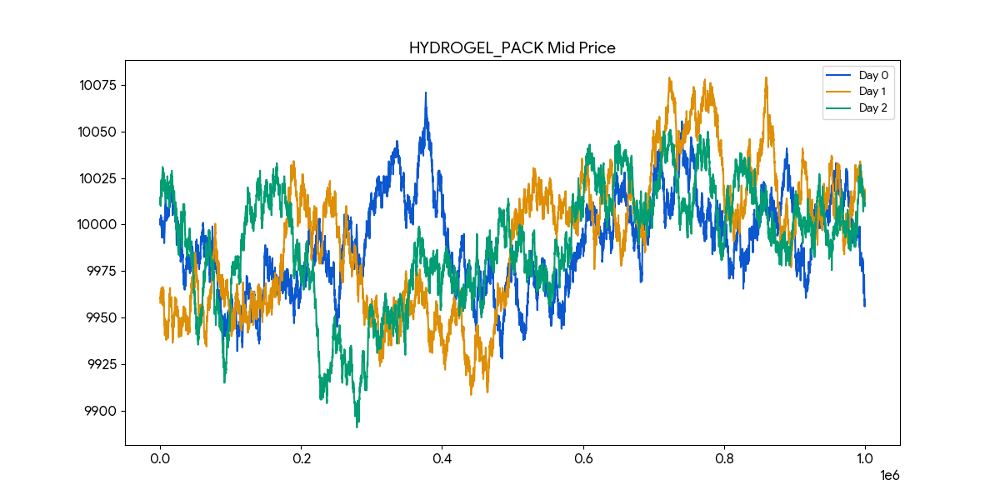

# Round 3: options on a new underlying

← [back to the README](../../README.md) · [round 1](round1.md) · [round 2](round2.md) · [round 4](round4.md)

Two underlyings plus a ten-strike option chain (position limits 200 and 300).
[`traders/round3_trader.py`](../../traders/round3_trader.py) scored **26,928** on the unseen
day.

Both underlyings turned out to be mean-reverting rather than trending, which is what makes
them quotable. Across all three days `HYDROGEL_PACK` stays inside a band of 188 ticks around
a mean of 9,991, and `VELVETFRUIT_EXTRACT` inside 102 around 5,250. Neither goes anywhere,
which is the opposite of the pepper root problem in [round 1](round1.md).

The trader market makes the chain with per-strike parameters, wider quotes near the money
where adverse selection costs most, and skips the far out-of-the-money strikes priced at the
minimum tick where there is no edge to take.

## Backtest

Three visible days, each run on its own and each starting flat:

| Day | PnL | Sharpe (ann.) | Max drawdown | Calmar |
|---|--:|--:|--:|--:|
| `3-0` | 34,247 | 36.91 | 7,658 | 4.47 |
| `3-1` | 50,290 | 40.03 | 9,116 | 5.52 |
| `3-2` | 43,245 | 19.40 | 22,610 | 1.91 |

Worth reading next to [round 4](round4.md), which is this strategy rewritten on the same
instruments. Same market, smaller and steadier PnL here: average drawdown 13.1k against
round 4's 80.2k.

Out of sample the chain prices off a volatility taken as given, and the round gives back
37% — the middle of the ordering described in
[the out-of-sample section](../../README.md#how-the-strategies-held-up-out-of-sample).

Full local backtests in [`results/README.md`](../../results/README.md). Official scoring,
with submission ids, in
[`results/official_submissions.md`](../../results/official_submissions.md).
