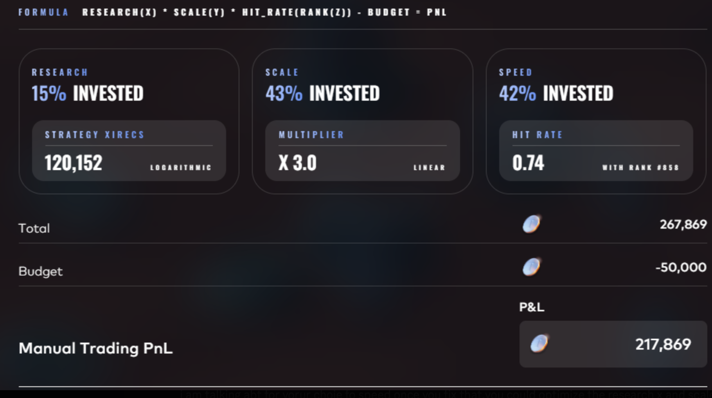
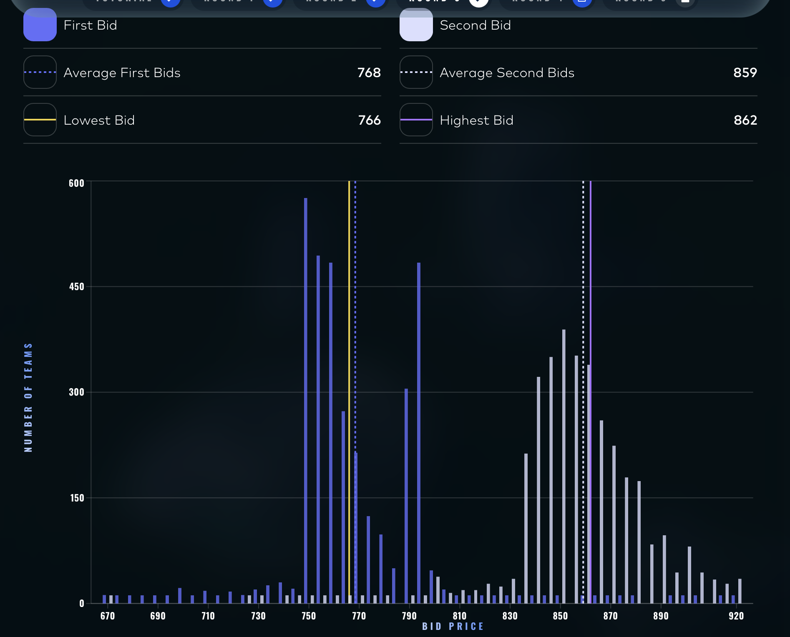
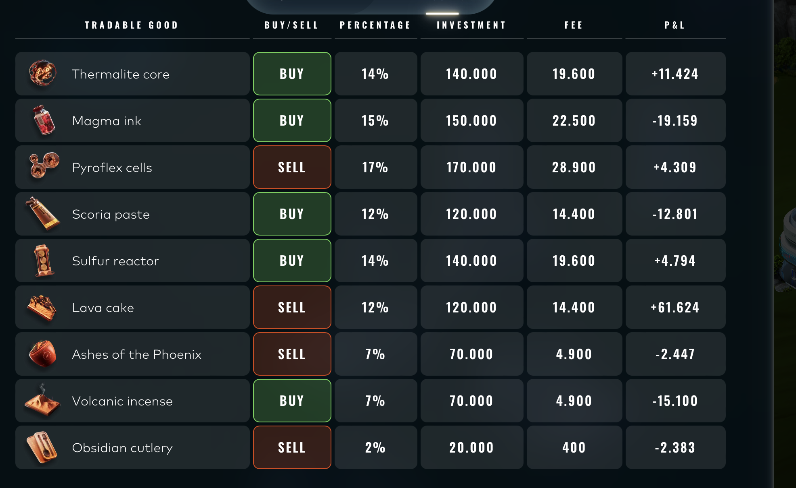

# The manual challenges

One decision per round, submitted once, scored once. No backtest, no second attempt, and in
two of the five rounds the payoff depended on what every other team did, which makes them
game theory problems rather than optimisation problems.

The work is MATLAB. It is organised by round below, and the sections are uneven because the
surviving material is uneven: some rounds have scripts, one has only the reasoning.

Overall the manual leg was the weaker half of the campaign: **1290th**, against 696th on the
algorithmic side.

---

## Round 1

Nothing survived. No script, no notes.

---

## Round 2: allocating across three levers, one of which is a race

The payoff was

```
RESEARCH(X) * SCALE(Y) * HIT_RATE(RANK(Z)) - BUDGET = PNL
```

Three levers to split a budget across. Research scaled logarithmically, Scale linearly, and
Speed did neither: it set a hit rate that depended on your **rank in Speed spending against
every other team**. So two of the three were an optimisation and the third was a race, where
the value of a unit of budget depended entirely on how many teams put in more.

The approach was to map the Pareto frontier of the three-way split, then deliberately bid
**below** the frontier point on Speed. In a rank-based race the marginal unit that buys a
place is worth a lot and the units above it are worth nothing, so the optimum against a
fixed field is unstable: everyone who computes it lands in the same place and the rank you
paid for evaporates. Sitting under it gives up a little expected value for a position that
does not depend on being the only one who did the arithmetic.

The field was modelled with a **t distribution rather than a normal**, because the tail is
where this is decided. A handful of teams overcommitting to Speed moves the whole rank
ladder, and a normal underweights exactly that.

Submitted allocation: **15% Research, 43% Scale, 42% Speed**, which returned a hit rate of
0.74 at rank #858.

The figure below is the platform's own read-out for that allocation.



No script survived for this one, so the above is the reasoning rather than something you can
re-run. It is here because it is the round where the game-theoretic framing mattered most,
not because there is code to show.

---

## Round 3: two sealed bids against a known distribution

Counterparties hold reserve prices uniform on 670 to 920 in steps of 5, and the product
resells at 920. You submit two bids. The first trades against any reserve below it. The
second trades against the remaining reserves below it, but if it falls under the average
second bid of every other team, the profit on it is scaled by

```
((920 - avgB2) / (920 - B2))^3
```

Cubic, so the penalty for being under the field is severe and non-linear. Like round 2, the
second bid is a decision about other players, not about the distribution.

**[`round3_bids/Bid1.m`](round3_bids/Bid1.m)** solves the first bid twice. Once analytically,
accumulating probability mass below each candidate bid and taking the expectation directly,
and once by simulating 10,000 draws of the counterparty pool. Two methods, one answer, which
is the only reason to trust either. The file also carries the clarifications collected before
committing: whether the range is inclusive, whether a counterparty can trade twice, and
whether the penalty applies to the first bid.

**[`round3_bids/Bid1and2_Simulation.m`](round3_bids/Bid1and2_Simulation.m)** searches the
pair jointly. It grids B1 and B2 over 700 to 900, draws 500 populations of 1,000
counterparties, samples a distribution for the field's average second bid, and computes the
penalty **per simulation** rather than once at the mean. That last detail is the point: the
penalty is convex, so averaging the inputs first and applying the formula once would report a
number the strategy never earns.

### How it went

Submitted bids were **766** and **862**. The field came in at an average first bid of 768 and
an average second bid of **859**.

The second bid cleared the field average by 3, which is the whole game: above `avgB2` the
cubic penalty does not apply at all, below it the profit on the second bid is cut hard. The
first bid landed just under the field's, which costs a little volume and nothing else.



---

## Round 4: pricing an option book, then sizing it

Eleven contracts on an underlying at 50 with volatility 2.51, quoted two-sided. Six vanilla
puts and calls at a three-week expiry, two vanillas at two weeks, and three exotics: a
chooser, a digital put paying 10 below 40, and a down-and-out put struck at 45 that dies if
the path ever touches 35.

**[`round4_options/MontecarloSim.m`](round4_options/MontecarloSim.m)** prices all eleven
under GBM. 1,000 runs of 1,000,000 paths at four steps per trading day, with **antithetic
variates**: half the normals are drawn and the other half are their negatives, so the
sampling error on the symmetric part of the payoff cancels. The barrier is priced off the
running path minimum rather than the terminal value, which is the only thing that makes it a
barrier.

**[`round4_options/AllocazioneOttima.m`](round4_options/AllocazioneOttima.m)** turns prices
into positions. Deltas by bump-and-revalue at 50.1 and 49.9, with both sets of paths built
from the **same normals**, so the difference is signal rather than Monte Carlo noise. It buys
where theo clears the ask by a minimum edge, sells where it clears the bid, then hedges the
net delta on the underlying, capped at 200 lots, and charges itself the half-spread for
doing so, reporting expected PnL net of that cost.

**[`round4_options/MonteSim_Interv_Conf.m`](round4_options/MonteSim_Interv_Conf.m)** and the
two allocators
**[`AllocOttima_Interv_Conf90.m`](round4_options/AllocOttima_Interv_Conf90.m)** /
**[`AllocOttima_Interv_Conf95.m`](round4_options/AllocOttima_Interv_Conf95.m)** are the
second pass. The pricer returns a confidence interval per contract instead of a point, and
the trading rule changes to match:

```matlab
% before: trade if the point estimate clears the quote
if theos(i) > asks(i) + min_edge

% after: trade only if the whole interval clears the quote
if ci_low(i) > asks(i)
```

On this book the two rules disagree about one contract out of eleven. `AC_60_C` prices at
8.7908 against a bid of 8.80, so the point estimate sells it on an edge of nine thousandths,
while its 95% interval reaches 8.8011 and crosses the bid. The claimed edge was smaller than
its own error bar. Every other decision is unchanged. The 95% variant also replaces the Monte
Carlo deltas with closed-form Black-Scholes for the vanillas.

What is left is five positions and six skips, and the split is not random. All six skips are
three-week vanillas, quoted tightly. All three exotics trade, against quotes off by 0.30 on
the chooser, 0.23 on the digital and 18% of price on the barrier. The two remaining trades
are the two-week vanillas at 0.12 each. The mispricing was where the pricing was hard.

Figures for both passes are in [`round4_options/figures/`](round4_options/figures).

### How it went

**+26,131, 670th for the round**, the best of the five manual rounds.

That is a reasonable result and not more than that. The pricing is textbook GBM with no
attempt at a smile, the volatility is taken as given rather than fitted, and the interval
rule was applied after the point-estimate version had already been built. It is worth reading
for the confidence-interval step and the shared-random-numbers delta, not as an options desk.

---

## Round 5: allocation under a quadratic fee

A budget of 1,000,000 on a market open for one day, nine goods, and a news feed called
Ashflow Alpha with one article per good. The directional call on each good came from reading
its article; there was no price history to fit.


The structure was the tractable part. A fee on an allocation of `p` percent of budget of

```
(p / 100)^2 * budget
```

Quadratic, so it prices concentration directly. Doubling a position quadruples what it costs
to hold.

**[`round5_portfolio/portafoglio.m`](round5_portfolio/portafoglio.m)** nets that fee against
the gross return of each of the nine positions and prints the book. It is short because once
the fee is quadratic the interesting decision is how flat to spread rather than what to pick.
Doubling a position quadruples what it costs to hold, so the fee alone rules out
concentrating on the article you like most, whatever it says.

### How it went

**+30,261, 1573rd for the round.** More PnL than round 4 and a much worse rank, which says
the returns were there for everyone and the allocation was not where the edge was.



---

## What the two game-theory rounds have in common

Rounds 2 and 3 both pay out against the field rather than against a distribution, and both
were approached the same way: find the optimum, then step off it deliberately. Below the
Pareto point on Speed in round 2, above the field average on the second bid in round 3. In
both cases the optimum computed against a fixed field is the place every other team that
does the arithmetic also lands, which is exactly where it stops being worth anything.
